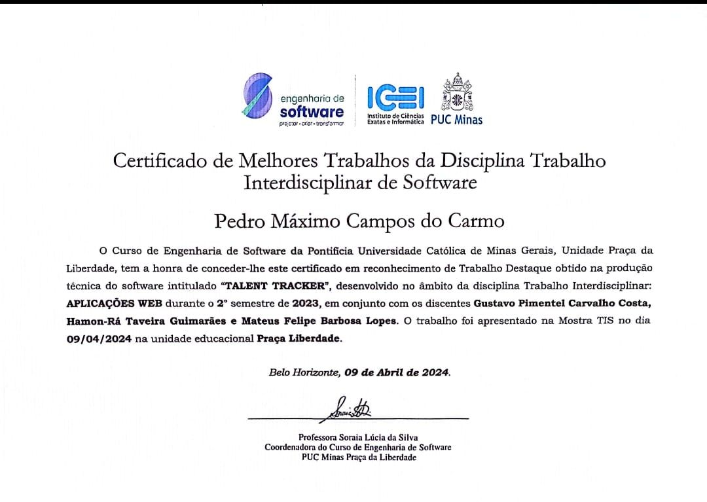

# Talent Tracker

Já deixou de fazer algo ou teve problemas ao encontrar profissionais qualificados para uma prestação de serviço?

A nossa aplicação vai acabar com os seus problemas, por oferecer um catálogo de experientes profissionais e avaliados por nossos usuários. Você pode procurar pelos mais diversos serviços, desde uma troca de lâmpada até uma sessão de tatuagem. Além disso, você pode consultar a disponibilidade, marcar um horário diretamente na plataforma ou entrar em contato com algum profissional.

## Alunos integrantes da equipe

- Gustavo Pimentel Carvalho Costa
- Hamon-Rá Taveira Guimarães
- Mateus Felipe Barbosa Lopes
- Pedro Máximo Campos do Carmo

## Professores responsáveis

- Cleiton Silva Tavares
- Gabriel Barbosa da Fonseca

## Contexto do Projeto

Este projeto em grupo foi realizado durante a matéria Trabalho Interdisciplinar 1 no curso de Engenharia de Software da PUC Minas. Foi reconhecido como um dos melhores trabalhos do semestre.

