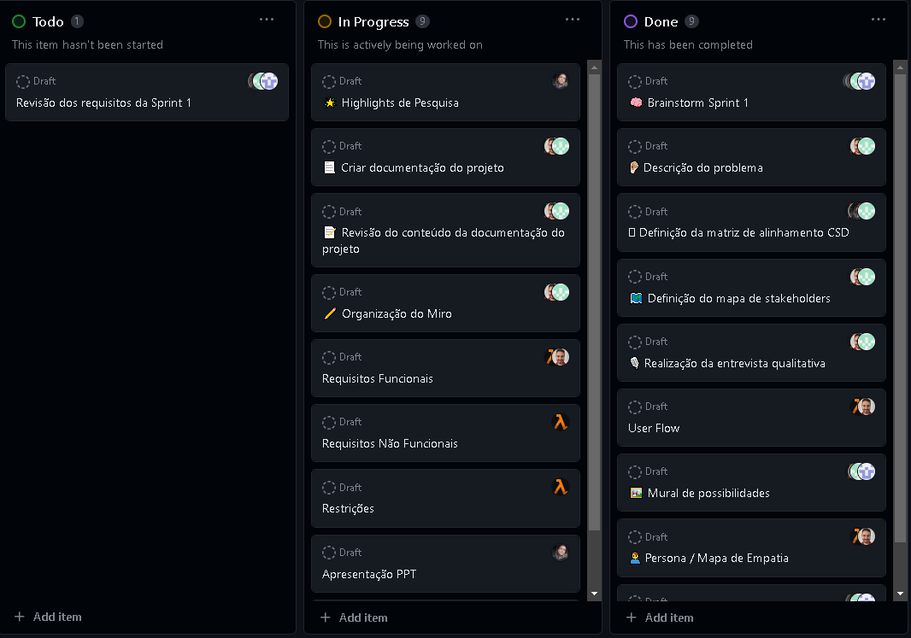

# Informações do Projeto

`Talent Tracker`

`Engenharia de Software`

## Participantes

> Os membros do grupo são:
>
> - Gustavo Pimentel Carvalho Costa
> - Hamon-Rá Taveira Guimarães
> - Pedro Máximo Campos do Carmo
> - Mateus Felipe Barbosa Lopes

# Estrutura do Documento

- [Informações do Projeto](#informações-do-projeto)
  - [Participantes](#participantes)
- [Estrutura do Documento](#estrutura-do-documento)
- [Introdução](#introdução)
  - [Problema](#problema)
  - [Objetivos](#objetivos)
  - [Justificativa](#justificativa)
  - [Público-Alvo](#público-alvo)
- [Especificações do Projeto](#especificações-do-projeto)
  - [Personas e Mapas de Empatia](#personas-e-mapas-de-empatia)
  - [Histórias de Usuários](#histórias-de-usuários)
  - [Requisitos](#requisitos)
    - [Requisitos Funcionais](#requisitos-funcionais)
    - [Requisitos não Funcionais](#requisitos-não-funcionais)
  - [Restrições](#restrições)
- [Projeto de Interface](#projeto-de-interface)
  - [User Flow](#user-flow)
  - [Wireframes](#wireframes)
- [Metodologia](#metodologia)
  - [Divisão de Papéis](#divisão-de-papéis)
  - [Ferramentas](#ferramentas)
  - [Controle de Versão](#controle-de-versão)
- [Projeto da Solução](#projeto-da-solução)
  - [Tecnologias Utilizadas](#tecnologias-utilizadas)
  - [Arquitetura da solução](#arquitetura-da-solução)
- [Avaliação da Aplicação](#avaliação-da-aplicação)
  - [Plano de Testes](#plano-de-testes)
  - [Ferramentas de Testes (Opcional)](#ferramentas-de-testes-opcional)
  - [Registros de Testes](#registros-de-testes)
- [Referências](#referências)

---

# Introdução

## Problema

O problema principal abordado é a desconexão entre prestadores de serviços e usuários que necessitam desses serviços.Muitas vezes, as pessoas enfrentam desafios ao tentar encontrar profissionais qualificados e confiáveis para atender às suas necessidades, enquanto os prestadores de serviços têm dificuldade em alcançar um público mais amplo e gerenciar eficazmente seus negócios. Isso cria um cenário onde:

**Ineficiência na conexão:**
Usuários podem ter dificuldade em encontrar os prestadores de serviços adequados para suas necessidades específicas, resultando em frustração e desperdício de tempo.

**Falta de transparência:**
A falta de informações transparentes sobre os prestadores de serviços, como avaliação, preços e disponibilidade, torna difícil para os usuários tomar decisões informadas.

**Gerenciamento descentralizado:**
Prestadores de serviços, especialmente autônomos e pequenas empresas, podem enfrentar desafios no gerenciamento de agendamentos, comunicação com os clientes e marketing de seus serviços.

**Potencial Perda de Oportunidades de Negócios:**
Prestadores de serviços podem perder oportunidades de negócios valiosas devido à falta de visibilidade online e mecanismos de agendamento eficientes.

## Objetivos

#### Geral:

O principal objetivo é o desenvolvimento de uma aplicação web de prestação de serviços. A solução será generalista, capaz de oferecer diversos serviços, que pode variar de uma simples pintura a uma reforma completa. Nela, haverá integração do usuário que procura um tipo de serviço específico e do prestador que deseja realizar o tipo de trabalho especificado. A ideia é que o aplicativo tenha um modelo de negócios, acessível e prático, além de algum tipo de assinatura, em que o usuário se torne prioridade na busca do prestador.

#### Específicos:

#### **Conhecer o tipo de usuários e prestador**

Conhecer o tipo de usuários e prestador.

Um dos pontos mais importantes do projeto e de seu desenvolvimento, auxiliará na definição de pontos importantes, como:

- Os requisitos de segurança.
- As formas de pagamento.
- O layout visual da interface web.
- Brainstorm de ideias.

Dessa forma, vamos priorizar este estudo do público-alvo.

#### **Análise de mercado**

Crucial para conhecimento da relevância do aplicativo, estudar profundamente os concorrentes diretos e indiretos, os público-alvos e as soluções existentes oferecidas, para auxiliar na definição do consumidor final.

#### **Categorizar os serviços**

Essencial para agrupar e identificar os serviços existentes em uma determinada região. Assim, um prestador pode ter ciência da sua concorrência e um cliente pode ter ciência dos profissionais disponíveis.

## Justificativa

A busca por serviços online tornou-se uma atividade cotidiana fundamental na vida das pessoas, principalmente na busca por serviços e trabalhos. Com a crescente expansão e inclusão digital, as pessoas agora dependem cada vez mais de agilidade ao encontrar serviços, informações e produtos online. Se tornou comum a busca por algum tipo de serviço específico, no qual, necessitam de um profissional para realizá-lo. Dessas prioridades de busca, a maioria é direcionada à busca por profissionais experientes e qualificados, que hoje em dia no mercado se tornaram escassos ou inacessíveis.

Nesse contexto, um estudo aprofundado sobre a busca de serviços online é crucial.

Primeiramente, a busca de serviços online desempenha um papel fundamental na economia digital atual. Milhões de empresas em todo mundo dependem da visibilidade online para atrair clientes e expandir seus negócios.

Outro ponto a compreender é como as pessoas buscam serviços online, pois isso pode ajudar empresas a otimizar suas estratégias de marketing digital, análise de mercado e melhorar as experiências do usuário em seus websites.

Além disso, o usuário espera encontrar informações precisas e relevantes de maneira eficiente quando buscam serviços, sejam eles relacionados a transportes, viagens, saúde e compras.

Um estudo aprofundado sobre a busca de serviços online pode ajudar a identificar desafios comuns enfrentados pelos consumidores, como informações desatualizadas, falta de transparência ou interface de busca inadequadas, e propor soluções para melhorar a experiência do usuário.

Um ponto crucial é a privacidade e a segurança online. Quanto mais os usuários compartilham informações pessoais ao buscar serviços, é importante considerar as implicações de proteção de dados e a segurança cibernética. Uma pesquisa sobre a busca de serviços online, pode contribuir ainda mais para o avanço da inteligência artificial e das tecnologias de busca. Quanto mais o avanço, mais sofisticado se tornam as análises, eficácia e eficiência.

Portanto, este trabalho de busca de serviços online é altamente relevante e pertinente num mundo cada vez mais digitalizado, podendo beneficiar empresas, consumidores, profissionais de tecnologia e pesquisadores.

## Público-Alvo

A aplicação tem como público-alvo dois grupos principais:

### 1. Prestadores de serviço:

- **Descrição Geral**: Este grupo é composto por indivíduos ou empresas que oferecem uma variedade de serviços, que podem incluir desde serviços de reparação, consultoria, educação, saúde, beleza, serviços criativos e muito mais.

- **Perfil Técnico**: Os prestadores de serviços podem possuir uma ampla gama de conhecimentos técnicos e habilidades, dependendo da natureza de seus serviços. Logo, isso pode variar desde profissionais altamente especializados, como médicos e advogados, até técnicos de manutenção e autônomos com habilidades específicas.

- **Experiência Tecnológica**: A experiência tecnológica pode variar consideravelmente, desde prestadores de serviços que estão familiarizados com o uso de aplicativos e plataformas online até aqueles que podem estar menos familiarizados com a tecnologia.

- **Motivação**: Os prestadores de serviços são motivados a utilizar a aplicação para promover seus serviços, encontrar novos clientes, gerenciar agendamentos e obter feedback dos clientes.

### 2. Usuários em busca de um serviço:

1. Descrição Geral:
   - Inclui pessoas e empresas que procuram serviços para atender necessidades pessoais ou comerciais.
2. Perfil de Conhecimento:
   - Varia de bem informado a iniciantes no serviço que buscam orientação.
3. Experiência Tecnológica:
   - Abrange desde usuários proficientes em aplicativos até aqueles que precisam de ajuda.
4. Motivação:
   - Usam o aplicativo para encontrar serviços confiáveis, acessíveis e convenientes que atendam às suas necessidades.

### 3. Relações Hierárquicas:

- Não existe uma hierarquia estrita entre os dois grupos de usuários. O aplicativo age como intermediário, facilitando a conexão entre prestadores de serviços e usuários que procuram serviços.

O público-alvo de um aplicativo de serviços pode variar, mas geralmente inclui pessoas de diferentes idades, localizações e níveis de renda, com ênfase em usuários que usam smartphones e aplicativos. A demografia, estilo de vida, interesses, necessidades específicas e comportamento de uso de tecnologia também são considerados ao definir o público-alvo. Além disso, as preferências culturais, sociais e o comportamento de consumo desempenham um papel importante. A análise de feedback e dados dos usuários ajuda a refinar o público-alvo ao longo do tempo.

### Casos de uso:

#### 1. Carona compartilhada

- **Prestador de Serviço:** Henrique, 25 anos, motorista particular, 2 anos de experiência, se inscreveu no aplicativo para oferecer caronas compartilhadas.
- **Usuário:** Julia, 22 anos, Estagiária, necessita de uma carona para ir ao trabalho todos os dias.

#### 2. Entrega de comida

- **Prestador de serviço:** João, 26 anos, Motoboy (Autônomo), 8 anos de experiência, realizará a entrega da comida do restaurante específico.
- **Usuário:** Rebeca, 32 anos, advogada, deseja pedir comida de um restaurante específico e a recebe em casa através do aplicativo.

#### 3. Limpeza residencial

- **Prestadora de Serviço:** Janete, 47 anos, empregada doméstica, 25 anos de experiência, faz parte de uma empresa de limpeza que se associou ao aplicativo para oferecer serviços de limpeza em residências.
- **Usuário:** Ricardo, 35 anos, engenheiro, é proprietário de uma casa que deseja agendar uma limpeza profissional para sua residência, toda semana.

#### 4. Assistência médica à domicílio

- **Prestador de Serviço:** Amanda, 27 anos, médica, 6 anos de experiência em serviços médicos em domicílio.
- **Usuário:** Bonifácio, 78 anos, aposentado, que necessita de cuidados médicos regulares em sua casa.

#### 5. Problema na parte elétrica da residência

- **Prestador de Serviço:** Gargamel, 54 anos, eletricista. Profissional com mais de 20 anos de experiência.
- **Usuário** Rosa, 42 anos, que solicita um eletricista com experiência para conserto da parte elétrica de sua casa, novo padrão, caixa elétrica, cabeamento e etc.

---

# Especificações do Projeto

- Miro:
  - Utilizamos o miro para realizarmos as tarefas: userflow, brainstorm, persona, mapa de Stakeholders, Mapa de Empatia, entrevista qualitativa.
- Git/Git-hub:
  - O controle de versão do código-fonte será realizado por meio do Git, com repositório hospedado no GitHub para colaboração e rastreamento de alterações.
- Git Projects:
  - As tarefas relacionadas ao desenvolvimento serão gerenciadas usando o Git Projects, uma funcionalidade do GitHub que permite o acompanhamento das atividades do projeto.
- Figma:
  - O design inicial do aplicativo será criado usando a ferramenta Figma, permitindo a criação de wireframes estáticos e interativos para visualização e testes.
- Vs Code:
  - O ambiente de desenvolvimento da aplicação será a IDE Vs Code, escolhida para sua eficiência e recursos de desenvolvimento.

## Personas e Mapas de Empatia

## Histórias de Usuários

Com base na análise das personas forma identificadas as seguintes histórias de usuários:

|EU COMO... `PERSONA`      | QUERO/PRECISO ... `FUNCIONALIDADE`                           |PARA ... `MOTIVO/VALOR`                                                               |
|--------------------------|--------------------------------------------------------------|--------------------------------------------------------------------------------------|
|Como usuário              |Quero poder me cadastrar à plataforma                         |Para que eu possa buscar por serviços                                                 |
|Como usuário              |Quero poder editar o meu perfil                               |Para que eu consiga inserir informações sobre mim                                     |
|Como usuário              |Quero poder solicitar qualquer serviço que preciso            |Para que eu possa delegar as tarefas que preciso fazer                                |
|Como usuário              |Quero pode agendar os serviços que preciso                    |Para que o mesmo fique agendado previamente em um dia e horário que fique bom para mim|
|Como usuário              |Quero poder filtrar os serviços por palavras chaves           |Para que eu consiga encontrar o serviço que desejo                                    |
|Como usuário              |Quero poder filtrar os serviços por região                    |Para que eu consiga encontrar o serviço que esteja mais perto de mim                  |
|Como usuário              |Quero uma plataforma simples e fácil de mexer                 |Para que eu consiga navegar e encontrar tudo que preciso                              |
|Como usuário              |Quero poder fazer comentários sobre o serviço que pedi        |Para que eu possa expressar a experiência que tive                                    |
|Como usuário              |Quero poder dar "likes" no serviço que pedi                   |Para que eu possa expressar a minha satisfação com o serviço oferecido                |
|Como usuário              |Quero poder fazer reclamações sobre o serviço que pedi        |Para que eu possa expressar a minha insatisfação com o serviço oferecido              |
|Como usuário              |Quero ter um código de início do serviço                      |Para que eu tenha a segunra que a pessoa certa veio ao local                          |
|Como usuário              |Quero ter um código de fim do serviço                         |Para sinalizar a plataforma que o prestador de serviço terminou o serviço             |
|Como usuário              |Quero recomendar serviços aos meus amigos                     |Para que eu posso dar dicas de bons prestadores de serviços                           |
|Como usuário              |Quero poder pagar pelo serviço prestado pela plataforma       |Para que eu me sinta segura com o preço combinado                                     |
|Como usuário              |Quero poder pedir reembolso pelo serviço fornecido            |Para que eu tenha garantia de caso o serviço não esteja certa eu posso receber o valor|
|Como usuário              |Quero poder fazer o upload de fotos e vídeos antes do serviço |Para que fique registrado o estado inicial do serviço                                 |
|Como usuário              |Quero poder fazer o upload de fotos e vídeos depois do serviço|Para que fique registrado o estado final do serviço                                   |
|Como usuário              |Quero poder ser um prestador de serviço                       |Para que eu consiga prestar os serviços que desejo e pedir os serviços que preciso    |
|Como usuário              |Quero poder cancelar o serviço que solicitei                  |Para que eu não tenha que receber um serviço que não preciso mais                     |
|Como prestador de serviço |Quero poder me cadastras à plataforma                         |Para que eu possa cadastrar os serviços que ofereço                                   |
|Como prestador de serviço |Quero poder editar o meu perfil de negócio                    |Para que eu consiga inserir informações sobre meu serviço                             |
|Como prestador de serviço |Quero poder inserir informações ao meu perfil de negócio      |Para que eu descreva as informações necessárias sobre o meu serviço                   |
|Como prestador de serviço |Quero poder cadastras negócios                                |Para que eu consiga oferecer meus serviços                                            |
|Como prestador de serviço |Quero poder ver a lista dos negócios que criei                |Para que eu consiga saber quais negócios que já estão cadastrados                     |
|Como prestador de serviço |Quero poder excluir um negócios                               |Para que eu não oferece negócios que não quero mais oferecer                          |
|Como prestador de serviço |Quero ter um código de início do serviço                      |Para que eu tenha a segurança que a pessoa certa veio ao local                        |
|Como prestador de serviço |Quero ter um código de fim do serviço                         |Para sinalizar a plataforma que o meu serviço terminou                                |
|Como prestador de serviço |Quero poder receber pelo serviço prestado pela plataforma     |Para que eu me sinta seguro de poder receber pelo serviço fornecido                   |
|Como prestador de serviço |Quero poder fazer o upload de fotos e vídeos antes do serviço |Para que fique registrado o estado inicial do serviço                                 |
|Como prestador de serviço |Quero poder fazer o upload de fotos e vídeos depois do serviço|Para que fique registrado o estado final do serviço                                   |
|Como sistema              |Quero poder ter assinantes GOLD pagos                         |Para que prestadores de serviços possam dar desconto e ficarem em destaque na busca   |
|Como sistema              |Quero poder ter assinantes CLUB pagos                         |Para que usuários possam receber descontos                                            |
|Como sistema              |Quero poder ter histórico de transações                       |Para que usuários e prestadores de serviço consigam se organizar                      |

## Requisitos

As tabelas que se seguem apresentam os requisitos funcionais e não funcionais que detalham o escopo do projeto.

### Requisitos Funcionais

|ID    | Descrição do Requisito                                                                 | Prioridade |
|------|----------------------------------------------------------------------------------------|------------|
|RF-001|Permitir que o usuário se cadastre na plataforma                                        |MÁXIMA      |
|RF-002|Permitir que o prestador de serviço se cadastre na plataforma                           |MÁXIMA      |
|RF-003|Permitir que o prestador de serviço cadastre serviços                                   |MÁXIMA      |
|RF-004|Permitir que o prestador de edite o perfil do seu negócio                               |MÁXIMA      |
|RF-005|Permitir que o usuário encontre serviços                                                |MÁXIMA      |
|RF-006|Permitir que o usuário edite o seu perfil                                               |BAIXO       |
|RF-007|Permitir que o usuário comente no serviço fornecido                                     |BAIXO       |
|RF-008|Permitir que o usuário der "likes" no serviço fornecido                                 |BAIXO       |
|RF-009|Permitir que o usuário agende serviços                                                  |MÁXIMA      |
|RF-010|Permitir que o usuário reclame do serviço fornecido                                     |MÉDIO       |
|RF-011|Permitir que o usuário recomende prestadores de serviço                                 |BAIXO       |
|RF-012|Permitir que a plataforma gere um código de início de serviço                           |ALTA        |
|RF-013|Permitir que a plataforma gere um código de fim de serviço                              |ALTA        |
|RF-014|Permitir que o prestador de serviço adicione uma área geográfica de atuação             |ALTA        |
|RF-015|Permitir que o usuário busque por área geográfica de atuação                            |ALTA        |
|RF-016|Permitir que o usuário envie fotos e vídeos no início e fim do serviço                  |MÉDIO       |
|RF-017|Permitir que o prestador de serviço envie fotos e vídeos no início e fim do serviço     |MÉDIO       |
|RF-018|Permitir que o sistema ofereça assunaturas GOLD para prestadores de serviço             |MÉDIO       |
|RF-019|Permitir que o sistema ofereça assunaturas CLUB para usuários                           |MÉDIO       |
|RF-020|Permitir que o usuário também sejam prestadores de serviço                              |MÁXIMA      |
|RF-021|Permitir que o usuário consiga cancelar um serviço                                      |MÁXIMA      |
|RF-022|Permitir que o prestador de serviço consiga cancelar um serviço                         |MÁXIMA      |

### Requisitos não Funcionais

|ID     | Descrição do Requisito                                                                                                               |Prioridade |
|-------|--------------------------------------------------------------------------------------------------------------------------------------|-----------|
|RNF-001|O sistema deve rodar somente em web                                                                                                   |MÁXIMA     |
|RNF-002|A plataforma deve processar requisições do usuário em no máximo 5s                                                                    |BAIXA      |
|RNF-003|Prestador de serviço deve preencher o campo de CPF ou CNPJ                                                                            |MÁXIMA     | 
|RNF-004|Usuário pode cancelar um serviço antes de 48 horas do mesmo                                                                           |MÁXIMA     |
|RNF-005|Prestador pode cancelar um serviço antes de 48 horas do mesmo                                                                         |MÁXIMA     |
|RNF-006|Caso o serviço seja cancelado pelo usuário dentro de 48 horas o mesmo deve pagar uma taxa de cancelamento igual a 50% do serviço      |MÁXIMA     |
|RNF-007|Caso o serviço seja cancelado pelo prestador dentro de 48 horas a plataforma incrementa na taxa de cancelamento do mesmo              |MÁXIMA     |
|RNF-008|Usuário CLUB pode cancelar a sua mensalidade em qualquer momento                                                                      |MÁXIMA     |
|RNF-009|Prestador GOLD pode cancelar a sua mensalidade em qualquer momento                                                                    |MÁXIMA     |
|RNF-010|Usuário somente poderá dar um feedback se utilizou o serviço                                                                          |MÁXIMA     |
|RNF-011|A plataforma deve ser simples e fácil de navegar                                                                                      |MÁXIMA     |
|RNF-012|A plataforma deve gerar um código para o prestador para terminar o serviço                                                            |MÁXIMA     |
|RNF-013|A plataforma deve gerar um código para o usuário começar o serviço                                                                    |MÁXIMA     |

## Restrições

O projeto está restrito aos itens apresentados na tabela a seguir.

| ID  | Restrição                                                  |
| --- | ---------------------------------------------------------- |
| 01  | O projeto deverá ser entregue até o final do semestre      |
| 02  | Não pode ser desenvolvido um módulo de backend             |
| 04  | O projeto deve ser desenvolvido utilizando HTML, CSS e JS  |
| 03  | O projeto deve ser entregue no prazo estipulado            |
| 04  | O projeto deve ser entregue seguindo as especificações     |
| 05  | Dados do usuário não serão deletados, seguindo a LGPD      |
| 06  | Dados do usuário devem ser armazenados de forma segura     |
| 07  | A plataforma deve utilizar criptografia end-to-end         |
| 08  | O deploy da plataforma deve ser utilziando o Heroku        |
| 09  | A plataforma irá atuar somente em território brasileiro    |
| 10  | A plataforma deve seguir normas e leis para cada município |

# Projeto de Interface

> ### 1. Meu Perfil
>
> 
>
> - Essa tela representa o usuário que irá procurar por um serviço. Tendo em vista que é uma pessoa chave para a plataforma, é uma tela importante.
> - Como o mesmo terá a possibilidade de procurar por um serviço, ele deve preencher, _Nome_ e _CPF_.
> - E-mail é preenchido quando o mesmo cria a conta.

> ### 2. Meu Negócio
>
> 
>
> - Essa tela representa o negócio do usuário. Como o mesmo deve preencher informações adicionais, optamos por dividir a tela de Usuário e Prestador de Serviço.
> - É importante o Prestador de Serviço preencher a área de atuação, essa informação será extremamente útil para o filtro.
> - A função agenda mostra a disponibilidade dos dias, em que o Prestador está disponível/ocupado.

> ### 3. Buscar Serviço
>
> 
>
> - Essa tela representa a parte mais importante da aplicação, ela é a junção entre o usuário que busca por um serviço e um prestador que oferece o mesmo.
> - A tela também contém um mapa apontando os serviços que são oferecidos na região em que deseja.

## User Flow

### 1. Telas

### 2. Fluxo Geral

### 3. Criar Conta

### 4. Criar Conta

### 5. Perfil Meu Negócio

### 6. Perfil do Usuário

### 7. Buscar por Serviço

### 8. Solicitar Serviço

### 9. Cancelar Serviço Usuário

### 10. Cancelar Serviço Prestador

### 11. Pagamento Serviço

### 12. Inicio Serviço

### 13. Fim Serviço

## Wireframes

### 1. Criar Conta

### 2. Login

### 3. Dashboard

### 4. Buscar Serviço

### 5. Meu Perfil

### 6. Meu Negócio

### 7. Meu Negócio

### 8. Filtros

### 9. Informação do Prestador

# Metodologia

Metodologia Ágil - Framework Scrum:

- O grupo optou por seguir o Framework Scrum para o desenvolvimento da aplicação. O Scrum é uma abordagem ágil que enfatiza a colaboração, transparência, adaptação e entrega incremental de funcionalidades.
- O processo Scrum será adaptado da seguinte maneira:
  1.  Sprint Planning:
      - O projeto será dividido em iterações chamadas "sprints". Cada sprint terá uma duração fixa (por exemplo, 2 semanas) e começará com uma reunião de Sprint Planning, onde as tarefas a serem realizadas durante o sprint são definidas e priorizadas.
  2.  Daily Standup:
      - Haverá reuniões diárias de "Daily Standup" para acompanhar o progresso, discutir impedimentos e ajustar as tarefas conforme necessário.
  3.  Sprint Review:
      - No final de cada sprint, uma revisão será realizada para demonstrar as funcionalidades concluídas aos stakeholders e coletar feedback.
  4.  Sprint Retrospective:
      - Após a revisão do sprint, haverá uma retrospectiva para identificar melhorias no processo e fazer ajustes para os próximos sprints.

### Github Projects

### Divisão de Papéis e Tarefas:

1. Product Owner:
   - Responsável por definir os requisitos, priorizar o backlog do produto e garantir que a equipe esteja desenvolvendo funcionalidades de alto valor para os usuários.
2. Scrum Master:
   - Responsável por facilitar o processo Scrum, remover impedimentos e garantir que a equipe esteja aderindo aos princípios e práticas do Scrum.
3. Equipe de Desenvolvimento:
   - Responsável pela implementação das funcionalidades, incluindo desenvolvedores, designers e outros membros necessários.

### Ferramentas Empregadas:

1. GitHub:
   - Para a gestão de configuração do projeto, versionamento de código e acompanhamento das tarefas através dos recursos do GitHub, como issues, projetos e pull requests.
2. Ferramentas de Scrum Online:
   - Serão utilizadas ferramentas online de gestão de projetos ágeis, como o Trello ou Jira, para o acompanhamento do backlog, planejamento de sprints e monitoramento do progresso da equipe.

### Processo de Design Thinking:

- O processo de Design Thinking será integrado ao desenvolvimento ágil, especialmente na fase de Sprint Planning e Sprint Review. Ele ajudará a manter um foco constante nas necessidades dos usuários, na empatia e na criação de soluções centradas no usuário.
- Gestão de Configuração do Projeto via GitHub:
  - O GitHub será utilizado para o controle de versão do código-fonte, com branches separadas para o desenvolvimento de funcionalidades e correções de bugs. As issues serão usadas para acompanhar tarefas e melhorias planejadas. O GitHub Projects pode ser usado para criar um quadro de tarefas Kanban para o projeto.

## Divisão de Papéis

Como todos mexeram no mesmo arquivo, que foi o relatório técnico, a divisão de papéis acabou não sendo crucial.
Em conversa com os professores nos foi aconselhado que essa divisão não era estritamente necessária e que cada membro da equipe não precisaria de ter papéis específicos. Portanto, todos realizamos o trabalho em conjunto nas plataformas Miro, Firma e VScode.

## Ferramentas

| Ambiente                    | Plataforma        | Link de Acesso                                                                                                                                                                                            |
| --------------------------- | ----------------- | --------------------------------------------------------------------------------------------------------------------------------------------------------------------------------------------------------- |
| Processo de Design Thinkgin | Miro              | https://miro.com/app/board/uXjVMkJZbbI=/?share_link_id=516111992548                                                                                                                                       |
| Repositório de código       | GitHub            | https://github.com/ICEI-PUC-Minas-PPLES-TI/plf-es-2023-2-ti1-0387100-talenttracker/tree/master                                                                                                            |
| Hospedagem do site          | Vercel            | https://talenttracker.vercel.app                                                                                                                                                                             |
| Protótipo Interativo        | MavelApp ou Figma | https://www.figma.com/proto/tK7XpJANfMzemWlf01b3Gx/wireframe-ti1?page-id=16%3A6&type=design&node-id=18-572&viewport=744%2C226%2C0.17&t=OAODdIzD3MtyVNor-1&scaling=contain&starting-point-node-id=18%3A572 |

## Controle de Versão

A ferramenta de controle de versão adotada no projeto foi o
[Git](https://git-scm.com/), sendo que o [Github](https://github.com)
foi utilizado para hospedagem do repositório `upstream`.

O projeto segue a seguinte convenção para o nome de branchs:

- `master`: versão estável já testada do software
- `sprint4`: Versão separada para a versão final. Essa versão tinha como proposito manter o repositório da master separado das entregas da sprint 2 e 3.
- `unstable`: versão já testada do software, porém instável
- `testing`: versão em testes do software
- `dev`: versão de desenvolvimento do software

Quanto à gerência de issues, o projeto adota a seguinte convenção para
etiquetas:

- `bugfix`: uma funcionalidade encontra-se com problemas
- `enhancement`: uma funcionalidade precisa ser melhorada
- `feature`: uma nova funcionalidade precisa ser introduzida

# Projeto da Solução

A solução para o problema foi desenvolvida com foco em clientes web, visando abranger uma variedade de dispositivos que possuem acesso à internet e um navegador web. Nesse sentido, a aplicação foi dividida em duas partes distintas: o FrontEnd e o salvamento do conteúdo no localstorage conforme passado pelos professores.

A primeira divisão refere-se à interface do usuário e inclui as páginas e elementos interativos destinados ao usuário final. A segunda divisão engloba a parte responsável por lidar com as regras de negócio da aplicação, processando e disponibilizando informações relevantes, como serviços, usuários e profissionais.

Além disso, o sistema integrado faz uso das APIs disponíveis no navegador, permitindo o controle efetivo das transações, dados e fluxos. De maneira a proporcionar uma abordagem mais eficiente e otimizada para a gestão da aplicação como um todo.

## Tecnologias Utilizadas

O projeto Talent Tracker visa conectar prestadores de serviços (usuários) a clientes em uma plataforma online. Para realizar essa solução, uma série de tecnologias foi empregada para desenvolver e implementar a solução. As tecnologias e ferramentas empregadas incluem:

-Git/GitHub: Para controle de versionamento do código-fonte, facilitando o trabalho em equipe e rastreando as alterações realizadas no projeto.

-HTML e CSS: Utilizamos HTML como linguagem de marcação para estruturar o conteúdo da aplicação web, enquanto o CSS foi empregado para estilização e formatação dos elementos visuais. O framework Bootstrap também foi adotado para garantir um design responsivo e atrativo.

-JavaScript: A linguagem foi aplicada para tornar a página mais dinâmica e interativa, possibilitando uma experiência de usuário mais fluida. Funcionalidades e interações foram desenvolvidas para enriquecer a experiência dos usuários na plataforma.

-Vercel: Utilizamos a plataforma de hospedagem Vercel para realizar o deploy da nossa aplicação web, permitindo que ela seja acessada e utilizada pelos usuários.

-Local Storage: Foi utilizado para armazenar dados localmente no navegador e todos os dados da aplicação "vivem" ali. *(PS: Como não foi um trabalho fullstack, seguimos a orientação dos professores ao utilizar o local storage.)*

-VS Code (IDE): Essa IDE de desenvolvimento foi empregada como ambiente principal para a codificação do projeto, fornecendo ferramentas e recursos para facilitar o desenvolvimento e depuração do código.

Diagrama de Interação Usuário-Sistema:

Diagrama de Interação

O diagrama ilustra a interação entre o usuário e o sistema Talent Tracker. O usuário interage com a aplicação web, navegando pelas páginas que foram estruturadas com HTML e estilizadas com CSS/Bootstrap. O JavaScript é responsável pela dinamicidade da página, interagindo com o Local Storage para salvar e recuperar dados do usuário. A Vercel hospeda a aplicação e fornece uma resposta ao usuário, exibindo a interface e as informações atualizadas na página web.

Observação: Substitua "link_para_a_imagem_do_diagrama" pelo link real para a imagem do seu diagrama de interação usuário-sistema, mostrando como a plataforma funciona. Certifique-se de descrever as tecnologias e ferramentas de forma precisa e personalizada, de acordo com as especificações do seu projeto.

## Arquitetura da solução

A arquitetura de uma aplicação web que utiliza APIs do navegador, é hospedada na Vercel e faz uso do LocalStorage para gerenciar e armazenar os dados pode ser descrita da seguinte maneira:

1. **FrontEnd:**

   - **Tecnologias:** Utilizamos a biblioteca Bootstrap e as lingugaens css, js e html.
   - **Hospedagem:** A aplicação front-end é implantada na Vercel, uma plataforma de hospedagem que oferece escalabilidade e integração contínua.
   - **API do Navegador:** Faz uso das APIs disponíveis nos navegadores, como a API Fetch, para realizar chamadas assíncronas para o servidor e interagir dinamicamente com os dados, assim como, a API localStorage para lidar com os dados.

2. **BackEnd (LocalStorage):**

   - **LocalStorage:** Foi utilizado como uma solução de back-end simulado para lidar com os dados.
   - **Manipulação de Dados:** O Localstorage foi utilizado para salvar os dados das operações CRUD (Create, Read, Update, Delete) sobre os dados simulados, oferecendo endpoints para as diferentes entidades da aplicação.

3. **Comunicação FrontEnd-BackEnd:**

   - **Chamadas Assíncronas:** O FrontEnd realiza chamadas assíncronas para apis de **openlayers** (API para mapas) e **nominatim** (API para pegar latitude e longitude dado um endereço).
   - **Formato de Dados:** É utilizado o formato JSON, sendo facilmente consumíveis pelo FrontEnd.

4. **Vercel:**

   - **Implantação e Escalabilidade:** A Vercel é utilizada para hospedar tanto o FrontEnd.

5. **Segurança:**
   - **HTTPS:** A Vercel fornece suporte padrão para HTTPS, garantindo a segurança das comunicações entre o cliente e o servidor.
   - **Validação e Sanitização de Dados:** É feito manualmente checando se os dados estão presentes.

# Avaliação da Aplicação

A aplicação desenvolvida atende de maneira eficaz ao seu papel como Minimum Viable Product (MVP), pois engloba todas as funcionalidades essenciais necessárias para cumprir o seu propósito inicial e já demonstra potencial nessa primeira versão.

O principal objetivo é estabelecer uma conexão entre usuários interessados e prestadores de serviço que estão em busca de novas oportunidades.

Ao fornecer as funcionalidades básicas necessárias, a aplicação permite que os usuários explorem e utilizem a plataforma de maneira significativa, promovendo a interação entre as partes interessadas. Essas funcionalidades básicas podem incluir recursos como cadastro de usuários, busca de serviços, perfis de prestadores de serviço, solicitação e oferta de serviços.

A aplicação proporciona uma base sólida para o desenvolvimento futuro, pois com a validação do conceito pela equipe de desenvolvimento e dos usuários, será possível a identificação de pontos de melhoria, a iteração e expansão futura de acordo com o feedback e as necessidades emergentes.

## Plano de Testes

## 1. Testes de Cadastro e Autenticação:

### 1.1 Cadastro de Usuários:

- Verificar se o processo de registro de novos usuários funciona corretamente.
- Garantir que os campos obrigatórios estejam devidamente validados.

### 1.2 Autenticação:

- Testar o processo de login para garantir que os usuários registrados possam acessar suas contas.
- Verificar se o sistema lida adequadamente com credenciais inválidas.

## 2. Testes de Funcionalidades Básicas:

### 2.1 Gerenciamento de Perfil:

- Testar a atualização de informações de perfil para usuários e profissionais.
- Verificar se as alterações no perfil são refletidas corretamente na interface.

### 2.2 Visualização de Serviços:

- Testar a funcionalidade de visualização em um mapa
- Verificar se os detalhes dos serviços são exibidos corretamente.

## 3. Testes Específicos para Profissionais:

### 3.1 Registro de Profissionais:

- Testar o processo de cadastro para profissionais.
- Garantir que informações adicionais específicas para profissionais sejam solicitadas e armazenadas corretamente.

### 3.2 Publicação de Serviços:

- Verificar se os profissionais conseguem publicar novos serviços.
- Testar a edição e exclusão de serviços publicados.

## 4. Testes de Compatibilidade:

### 4.1 Navegadores e Dispositivos:

- Testar a plataforma em diferentes navegadores (Chrome, Firefox, Safari, Edge).
- Garantir que a plataforma seja responsiva e funcione corretamente em dispositivos móveis e tablets.

## 5. Testes de Integração:

### 5.1 Integração FrontEnd-BackEnd:

- Verificar se os dados são corretamente transmitidos entre o FrontEnd e o BackEnd.

## 6. Testes de usabilidade:

### 6.1 Mensagens de Erro:

- Verificar se as mensagens de erro são informativas e orientam os usuários sobre as ações corretivas.

### 6.2 Interface:

- Avaliar a interface do usuário quanto à facilidade de navegação e compreensão.
- Realizar testes de usabilidade com usuários reais para obter feedback.

## 7 Documentação Técnica:

- Avaliar a documentação técnica para desenvolvedores, garantindo que seja completa e compreensível.

# Registros de Testes

Os testes foram feitos de forma manual, que apesar das desvantagens em relação aos automatizados, realizaram um papel crucial durante o desenvolvimento e na execução do aplicativo, especialmente na validação da usabilidade, experiência do usuário e aspectos subjetivos que podem ser difíceis de automatizar completamente.

Uma combinação futura de testes manuais e automatizados poderá ser garantir uma maior qualidade.

## 1. Testes de Cadastro e Autenticação:

### 1.1 Cadastro de Usuários:

Manualmente, inserimos dados válidos e inválidos nos campos do formulário de registro para garantir que a validação está adequada.
Verificamos se o processo de registro é concluído com sucesso.

### 1.2 Autenticação:

Realizamos testes de login com credenciais corretas e incorretas para confirmar o acesso adequado ou a rejeição de credenciais inválidas.

## 2. Testes de Funcionalidades Básicas:

### 2.1 Gerenciamento de Perfil:

Atualizamos manualmente as informações do perfil e confirmamos se as alterações são refletidas corretamente na interface.

### 2.2 Visualização de Serviços:

Manualmente, testamos a funcionalidade de visualização em um mapa e verificamos se os detalhes dos serviços foram exibidos corretamente.

## 3. Testes Específicos para Profissionais:

### 3.1 Registro de Profissionais:

Preenchemoms manualmente os campos específicos para profissionais durante o processo de registro e confirmamos se as informações são armazenadas corretamente.

### 3.2 Publicação de Serviços:

Manualmente, testamos a capacidade dos profissionais de publicar, editar e excluir serviços, verificando se as alterações são refletidas na plataforma.

## 4. Testes de Compatibilidade:

### 4.1 Navegadores e Dispositivos:

Manualmente, testamos a plataforma em diferentes navegadores e dispositivos para garantir que a interface fique responsiva e funcional.

## 5. Testes de Integração:

### 5.1 Integração FrontEnd-BackEnd:

Testamos manualmente a transmissão de dados entre o FrontEnd e o BackEnd para confirmar que a integração está ocorrendo conforme o esperado.

## 6. Testes de Usabilidade:

### 6.1 Mensagens de Erro:

Intencionalmente provocamos erros e confirmamos que as mensagens de erro estão claras e significativas aos usuários.

### 6.2 Interface:

Realizamos testes de usabilidade com usuários reais, observando a navegação e coletando feedback sobre a interface.

## 7. Documentação Técnica:

Avaliamos manualmente a documentação técnica, verificando se está completa, precisa e compreensível.

## Desafios

Os testes manuais consumiram tempo e energia, especialmente por terem que ser realizados com frequência, o que os torna impraticáveis em ambientes de desenvolvimento ágeis. Além disso, eles são caracterizados por alta instabilidade e inconsistência, apresentando uma probabilidade significativa de erros humanos. Conforme a complexidade e o tamanho da aplicação aumentaram, tornou-se praticamente impraticável manter uma abordagem manual eficiente.

# Referências

## Inspirações

- https://www.airbnb.com
- https://www.getninjas.com.br
- https://www.workana.com/
- https://br.fiverr.com
- https://www.upwork.com
- https://br.linkedin.com

## Estudo / Técnicos

- https://www.geeksforgeeks.org/
- https://javascript.info/
- https://www.w3schools.com/
- https://web.dev/learn
- https://developer.mozilla.org/
- https://htmlreference.io
- https://cssreference.io
- https://vercel.com/
- https://www.npmjs.com/package/json-server
